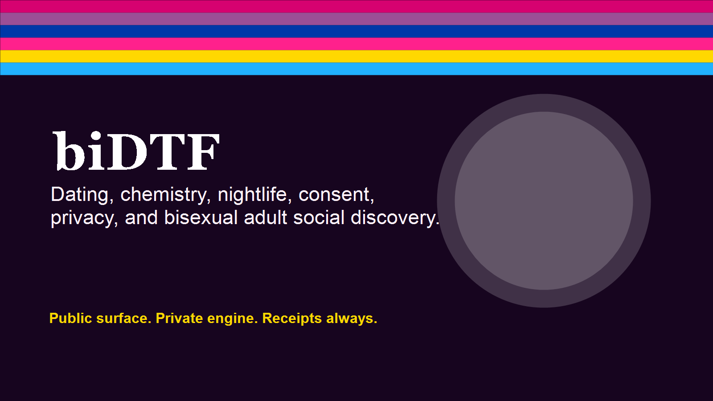

# biDTF

Dating, chemistry, nightlife, and consent-forward adult social discovery for bi, pan, fluid, queer, ENM-friendly, and questioning adults.

> This repository is a protected public project surface. It is not the full source code, operational system, private workflow, or data room.

## Why It Matters

biDTF is the dating, flirting, ENM-friendly discovery, nightlife, chemistry, and adult social lane in the BiNet ecosystem.

This public repository establishes ownership, legitimacy, project status, visual context, and safe paths for learning more while protecting source code, private workflows, credentials, user data, raw backups, and unreleased strategy.

## How It Works

The public surface explains purpose, audience, workflow, status, and boundaries. The private engine remains outside this repository. Receipts and status documents show what is public, what is protected, and what still needs review.

## Public Materials

- Project brief and roadmap in docs/.
- Visual assets in assets/.
- Workflow and boundary diagrams in assets/diagrams/.
- WordPress page draft in wordpress/.
- Receipt and launch checklist for repository preparation.

## Protected Materials

Source code, prompts, agent instructions, raw backups, SQL, credentials, user data, donor/payment records, legal/admin records, private workflows, private evidence, and operational infrastructure are not included.

## Current Status

Public project surface prepared. Product source and operational systems remain private.

## Learn More

- Project homepage: [https://binetusa.org/binet-app/](https://binetusa.org/binet-app/)
- Owner: Faith Cheltenham / The Fayth
- Repository target: [https://github.com/thefayth/bidtf](https://github.com/thefayth/bidtf)

## Ownership

All rights reserved. No public license is granted. No redistribution, commercial reuse, model training, scraping, or derivative use is permitted without written permission.

